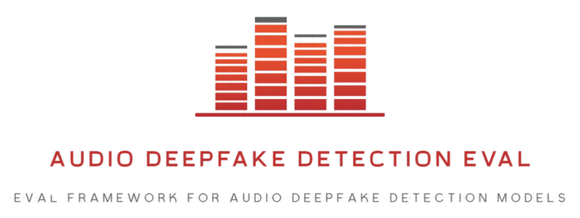
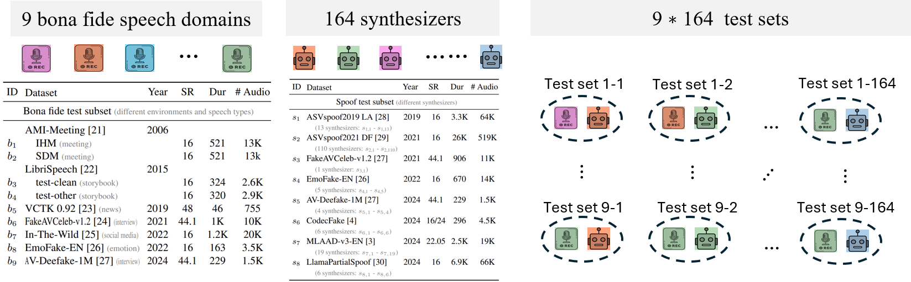
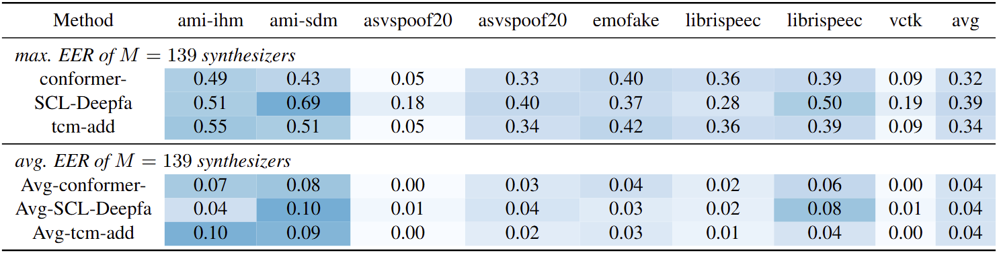
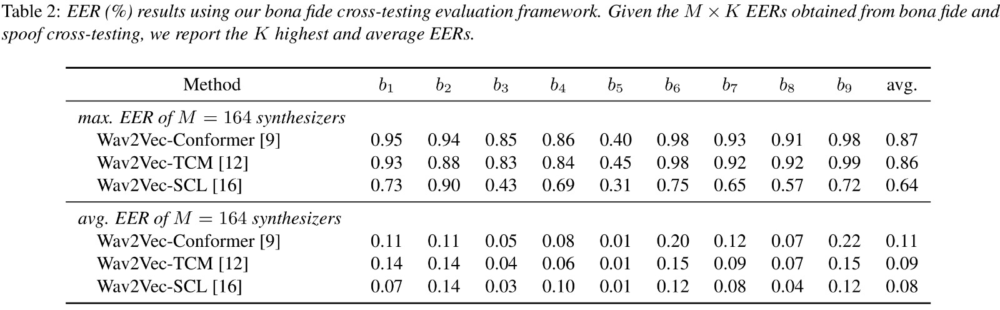

# Audio Deepfake Detection Eval

<p align="center">
    <br>
    
    <br>
</p>

<p align="center">

<a href="https://github.com/ntu-dtc/audio_deepfake_eval/pulls"></a>
</p>

A comprehensive evaluation framework for audio deepfake detection (ADD) from [NTU DTC](https://www.ntu.edu.sg/dtc), providing standardized tools for computing Equal Error Rates (EERs) and analyzing model performance across diverse datasets.

## 📋 Contents
- [Introduction](#-introduction)
- [Key Features](#-key-features)
- [Installation](#️-installation)
- [Quick Start](#-quick-start)
- [Advanced Usage](#-advanced-usage)
- [Supported Datasets](#-supported-datasets)
- [Roadmap](#-roadmap)
- [News](#-news)

<p align="center">
  • • •
</p>

## 📝 Introduction

Standard ADD evaluations often rely on datasets that unevenly represent different synthesizers and lack diversity in bona fide speech, leading to biased and less reliable Equal Error Rate (EER) measurements.

Our framework introduces bona fide cross-testing, incorporating multiple bona fide speech datasets to ensure balanced assessments. By aggregating EERs across diverse speech types, BonaFideCrossEval improves robustness, interpretability, and real-world applicability.

We benchmark over 150 synthesizers across nine bona fide speech types and release a new dataset to facilitate further research. 🚀

<p align="center">
  
  <br>Audio Deepfake Detection Eval Framework
</p>

<p align="center">
  • • •
</p>

## ✨ Key Features

1. **Spoof Cross Testing**: Evaluate models by pairing a single bona fide speech type with multiple synthesizer datasets
2. **Bona Fide Cross Testing**: Test against diverse bona fide speech types for robust evaluation
3. **EER Aggregation**: Summarize results using maximum pooling to identify challenging synthesizers
4. **Comprehensive Visualization**: Generate detailed plots and statistics for analysis
5. **Flexible Dataset Support**: Evaluate on standard and custom datasets

<p align="center">
  • • •
</p>

## 🛠️ Installation

### Method 1: Using pip

1. Create and activate a virtual environment (recommended)
   ```bash
   # Create virtual environment
   python -m venv add_eval_env
   
   # Activate virtual environment
   # On Windows
   .\add_eval_env\Scripts\activate
   # On Unix or MacOS
   source add_eval_env/bin/activate
   ```

2. Install the package in development mode
   ```bash
   # Clone the repository
   git clone https://github.com/ntu-dtc/audio_deepfake_eval.git
   cd audio_deepfake_eval
   
   # Install in development mode
   pip install -e .
   ```

### Method 2: Manual Installation

```bash
git clone https://github.com/ntu-dtc/audio_deepfake_eval.git
cd audio_deepfake_eval
pip install -r requirements.txt
```

### Project Structure
```
audio_deepfake_eval/
├── audio_deepfake_eval/          # Main package directory
│   ├── __init__.py              # Package initialization
│   ├── add_detect_eval/         # Core evaluation modules
│   │   ├── compute_eers.py
│   │   └── compute_eers_cross_testing.py
│   └── utils/                   # Utility modules
│       ├── __init__.py
│       └── latex_table.py
├── configs/                     # Configuration files
├── docs/                        # Documentation
├── requirements.txt             # Dependencies
└── setup.py                     # Package setup
```

### Dependencies
- Python >= 3.8
- numpy
- scipy
- matplotlib
- pandas
- PyYAML
- scikit-learn

<p align="center">
  • • •
</p>

## 🚀 Quick Start

### 1. Run Evaluation

Compute Equal Error Rate (EER) for one of the dataset listed in the config:

```bash
python audio_deepfake_eval/compute_eers.py --config configs/config.yaml --dataset asvspoof2021_df
```

If you don't specify a dataset, the script will show available datasets:
```
ERROR: Please specify a dataset to evaluate using --dataset

Available datasets in config:
   asvspoof2021_df
   academicodec_hifi_16k_320d

Example usage:
   python audio_deepfake_eval/compute_eers.py --config configs/config.yaml --dataset <dataset_name>
```

Example output:
```
Processing dataset: [asvspoof2021_df]
   Including patterns: *.wav

Computing EER...
EER: 3.47%

Codec statistics:
   mp3: 500 files
   aac: 300 files
   opus: 200 files

Synthesizer statistics:
   fastspeech2: 400 files
   tacotron2: 300 files
   glow-tts: 300 files
```

### 2. Visualize Results

```bash
python audio_deepfake_eval/visualize_stats.py \
  --config configs/config.yaml \
  --dataset asvspoof2021_df \
  --output-dir ./visualizations
```

Example output:
```
Processing dataset: [asvspoof2021_df]
   Including patterns: *.wav

Visualization saved to ./visualizations/asvspoof2021_df_statistics.png
```

<p align="center">
  • • •
</p>

## 🔍 Advanced Usage

### Cross-Testing Evaluation

Evaluate models across different combinations of bonafide and spoof datasets:

```bash
python audio_deepfake_eval/compute_eers_cross_testing.py \
  --config configs/config.yaml \
  --output-dir ./output \
  --plot-dir ./visualizations
```

This script performs two main tasks:

#### 1. Cross-Testing Matrix

Generates a heatmap visualization showing EERs for each combination of bonafide and spoof datasets.

**Output Structure:**
```
output/
├── eer_matrix.csv         # Cross-testing EER results in CSV format
├── eer_details.json       # Detailed EER calculations and thresholds
└── results.json          # Summary statistics and metadata

visualizations/
├── merged_cross_testing_matrix.png  # Heatmap visualization of EER matrixes for all models tested so far
└── <model_dir>/                    # Directory for each model's visualizations
    └── cross_testing_matrix.png    # Individual model's cross-testing matrix
```

**Log Output:**
```
Processing dataset: [asvspoof2021_df]
   Including patterns: *.wav

Dataset Summary:
   Bonafide subsets: [librispeech_clean], [vctk]
   Spoof subsets: [asvspoof2021_df], [av_deepfake_1m]

Computing EER:
   Bonafide subset:  [vctk]
   Spoof subset:     [av_deepfake_1m]
   Using synthesizer: [vits_word]
Sample counts:
   Spoof samples:    180
   Bonafide samples: 755
EER: 3.47%

Results saved successfully:
   EER results and statistics: ./output
   Visualization plots: ./visualizations
```

#### 2. LaTeX Table Generation

Creates a comprehensive LaTeX table that includes:

| Feature | Description |
|---------|-------------|
| **Maximum EERs** | Highest EER across all synthesizer types for each model and bonafide subset |
| **Average EERs** | Mean EER across all synthesizer types for each model and bonafide subset |
| **Color Coding** | Blue gradient indicating EER values (darker = higher EER) |
| **Formatting** | Values formatted to 2 decimal places |
| **Structure** | Horizontal rule separating max and average sections |
| **Labels** | Model names and bonafide subset names truncated to 10 characters |

<p align="center">
  
  <br>
  <em>Example LaTeX Table Format</em>
</p>

The LaTeX table is automatically generated and printed to the console, ready to be copied into your LaTeX document. The table structure is optimized for readability and includes proper LaTeX formatting for color coding and alignment.

## 📊 Cross-Testing Matrix Visualizations

The framework generates two types of cross-testing matrix visualizations to help you analyze model performance:

<div align="center">
<table>
  <tr>
      <td align="center" width="50%">
        <b>🔍 Individual Model Matrix</b><br>
        <em>Performance analysis for a single model</em>
    </td>
      <td align="center" width="50%">
        <b>🔄 Merged Cross-Testing Matrix</b><br>
        <em>Comparative analysis across multiple models</em>
    </td>
  </tr>
</table>
</div>

### 1. Individual Model Matrix

<p align="center">
  
  <br>
  <em>Cross-Testing EER Matrix Heatmap</em>
</p>

Each model's cross-testing matrix shows the Equal Error Rate (EER) for different combinations of bona fide and spoof datasets. The matrix is organized as follows:

| Element | Description |
|---------|-------------|
| **X-axis** | Bona fide datasets (source of genuine audio samples) |
| **Y-axis** | Synthesizer IDs (numbered 1 to N, where N is the number of spoof datasets) |
| **Color intensity** | EER value (darker blue indicates higher EER, meaning worse performance) |

This visualization helps you understand how well your model performs when tested on different combinations of genuine and synthetic audio.

### 2. Merged Cross-Testing Matrix

<p align="center">
  
  <br>
  <em>Merged Cross-Testing EER Matrix Heatmap</em>
</p>

The merged cross-testing matrix combines results from all models in a single visualization, allowing for direct comparison of performance across different models:

| Element | Description |
|---------|-------------|
| **Layout** | Grid of heatmaps, with one heatmap per model |
| **X-axis** | Bona fide datasets (consistent across all models) |
| **Y-axis** | Synthesizer IDs (numbered 1 to N) |
| **Color intensity** | EER value (darker blue indicates higher EER) |
| **Color range** | Fixed from 0% to 35% for all models |
| **Title** | Model name and mean EER percentage |

This merged visualization is automatically generated after running `compute_eers_cross_testing.py`. It provides a comprehensive view of how different models compare in terms of their ability to detect audio deepfakes across various dataset combinations.

The merged matrix is saved as `merged_cross_testing_matrix.png` in the visualizations directory and is updated each time you run the evaluation script.

<p align="center">
  • • •
</p>

## 🔧 Use your own model and dataset for evaluation

After you run your own model on custom datasets and obtain the classification scores, you can evaluate them by:
1. Preparing the score files following the structure in `eer_files/`
2. Preparing the configuration files

### 1. 📁 Prepare Score Files

The `eer_files/` directory contains the classification scores for each model. The structure is as follows:

```
eer_files/
├── model_name_1/
│   ├── scores/
│   │   ├── dataset1.txt
│   │   ├── dataset2.txt
│   │   └── ...
│   └── keys/
│       ├── dataset1.txt
│       ├── dataset2.txt
│       └── ...
├── model_name_2/
│   ├── scores/
│   │   └── ...
│   └── keys/
│       └── ...
└── ...
```

Each model directory contains:
- `scores/`: Contains text files with classification scores for each dataset
- `keys/`: Contains text files with ground truth labels for each dataset

#### 📝 The score file follows this format:
```
audio_id_1 score_value_1
audio_id_2 score_value_2
...
```

Where:
- `audio_id`: The identifier of the audio file (without extension)
- `score_value`: This is the classification score (higher values indicate higher confidence of being a spoof)

Example score file (`eer_files/model_name/scores/asvspoof2021_df.txt`):
```
ASV21_DF_T_0000001 0.123
ASV21_DF_T_0000002 0.456
ASV21_DF_T_0000003 0.789
...
```

#### 📝 The key file format is:
```
- <audio_id> <codec> - <synthesizer_type> <label> - eval - - - - -
```

Where:
- `audio_id`: The identifier of the audio file
- `codec`: The audio codec used (e.g., "mp3", "aac", "nocodec", or "-" if not applicable)
- `synthesizer_type`: The synthesizer used (e.g., "fastspeech2", or "-" if not applicable)
- `label`: The ground truth label ("bonafide" or "spoof")
- The remaining hyphens are dummy columns for compatibility

Example key file (`eer_files/model_name/keys/asvspoof2021_df.txt`):
```
LA_0039 LA_E_2834763 nocodec asvspoof A11 spoof notrim eval Unknown - - - -
LA_0040 LA_E_2834764 mp3 - A12 bonafide notrim eval Unknown - - - -
LA_0041 LA_E_2834765 - - A13 bonafide notrim eval Unknown - - - -
...
```

### 2. ⚙️ Prepare Configuration

Create `config.yaml` inside the folder `configs/`:
```yaml
model_name: "conformer-based-classifier-for-anti-spoofing"
eer_files_dir: "./eer_files"

datasets:
  - name: "asvspoof2021_df"
    include_patterns:
      - ".wav"
      - "p227"
      - "p228"
  - name: "academicodec_hifi_16k_320d"
    include_patterns:
```

The `include_patterns` field is optional for each dataset. When specified:
- Only audio samples whose IDs match any of the patterns will be included in the evaluation
- Patterns can be file extensions (e.g., ".wav"), speaker IDs (e.g., "p227"), or any other ID pattern
- If not specified, all samples in the dataset will be evaluated
- Multiple patterns can be specified to include different subsets of samples

For example, to evaluate only samples from speakers p227 and p228:
```yaml
datasets:
  - name: "vctk"
    include_patterns:
      - "p227"  # Include samples from speaker p227
      - "p228"  # Include samples from speaker p228
```

<p align="center">
  • • •
</p>

## 📊 Supported Datasets

### 🎵 Audio Codecs
✅ CodecFake  
✅ academicodec_hifi_16k_320d  
✅ audiodec_24k_320d  
✅ descript-audio-codec-16khz  
✅ encodec_24khz  
✅ funcodec-funcodec_en_libritts-16k-nq32ds320  

### 🗣️ Speech Datasets  
✅ librispeech_test_clean  
✅ librispeech_test_other  
✅ ami_ihm  
✅ ami_sdm  
✅ vctk  

### 🎭 Deepfake Detection Datasets
✅ asvspoof2021_df  
✅ asvspoof2019_la  
✅ av_deepfake_1m  
✅ emofake  
✅ fakeavceleb  
✅ llamapartialspoof_r01tts0a  
✅ llamapartialspoof_r01tts0b  
✅ mlaad  
✅ partialspoof  
✅ release_in_the_wild  
✅ scenefake  
✅ speech_tokenizer 

<p align="center">
  • • •
</p>

## 📥 Dataset Access

<div align="center">
  <table>
    <tr>
      <td align="center" width="50%">
        <b>🚀 Quick Download</b><br>
        <em>Pre-processed datasets in a single package</em>
      </td>
      <td align="center" width="50%">
        <b>🔍 Manual Download</b><br>
        <em>Individual dataset access with detailed instructions</em>
      </td>
    </tr>
  </table>
</div>

| Option | Description | Size | Link |
|--------|-------------|------|------|
| 📦 **All-in-One Package** | Pre-processed datasets with 600 samples per type | ~2GB | [Zenodo](https://zenodo.org/) |
| 📚 **Detailed Guide** | Step-by-step instructions for each dataset | Varies | [Dataset Guide](datasets/README.md) |

> 💡 **Pro Tip:** The all-in-one package is recommended for quick evaluation. For full datasets or specific subsets, follow the manual download guide in [datasets/README.md](datasets/README.md).

<p align="center">
  • • •
</p>

## 📈 Leaderboard

<p align="center">
  
  <br>
  <em>Model Performance Comparison on Different Datasets</em>
</p>

The leaderboard shows Equal Error Rate (EER) performance of different models across various datasets. Lower EER indicates better performance in distinguishing between genuine and spoofed audio.

<p align="center">
  • • •
</p>

## 🔜 Roadmap

### ✅ Completed
✅ Single dataset EER evaluation  
✅ Compute audio statistics for datasets  
✅ Audio statistics visualization  
✅ Cross testing EER evaluation  
✅ Cross testing EER visualization  

### 🚧 In Progress
⬜ Latex table results generation  
⬜ Support for new audio codecs  
⬜ Integration with more deepfake detection models  
⬜ Real-time evaluation pipeline  

<p align="center">
  • • •
</p>

## 🎉 News

- 🔥 **[2025.05.26]** Official release with benchmark results for 164 synthesizers and 9 bona fide speech styles
- 🔥 **[2024.09.18]** Documentation released with technical research and discussions.

> ⭐ If you like this project, please star it! Your support motivates us to keep improving.
